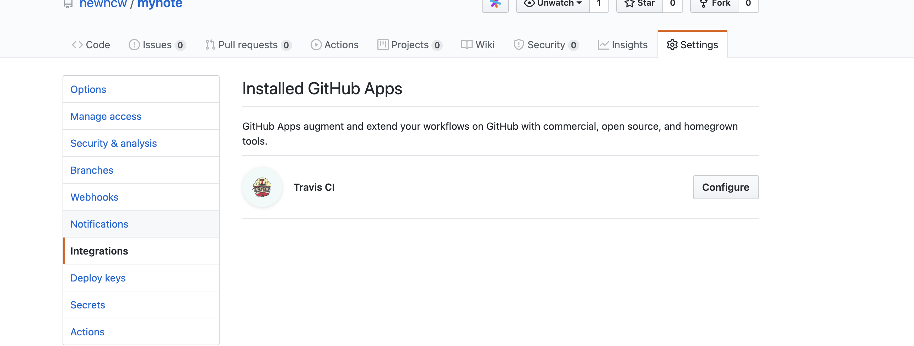
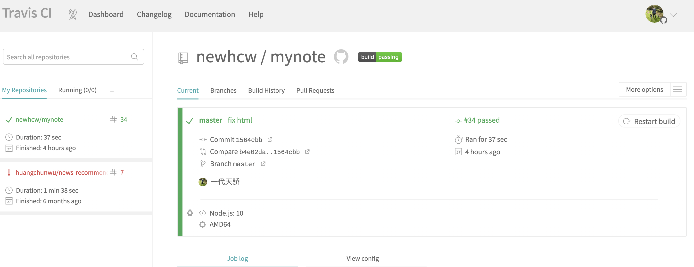
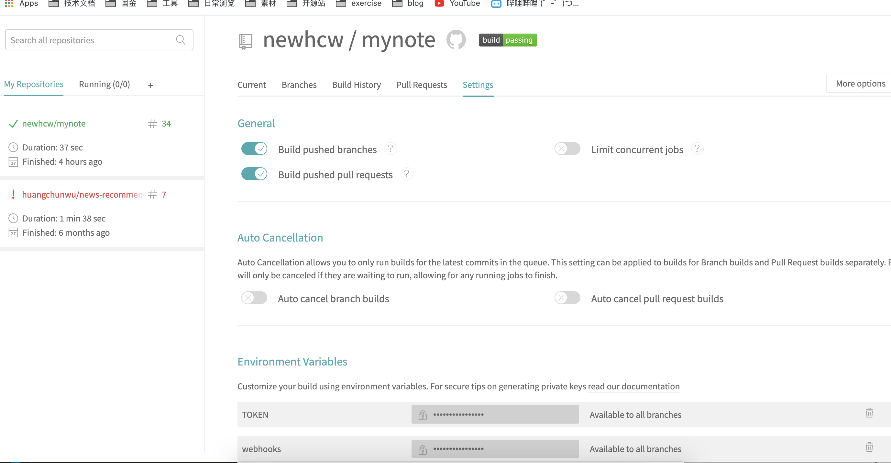
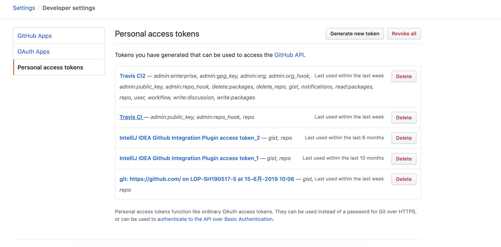
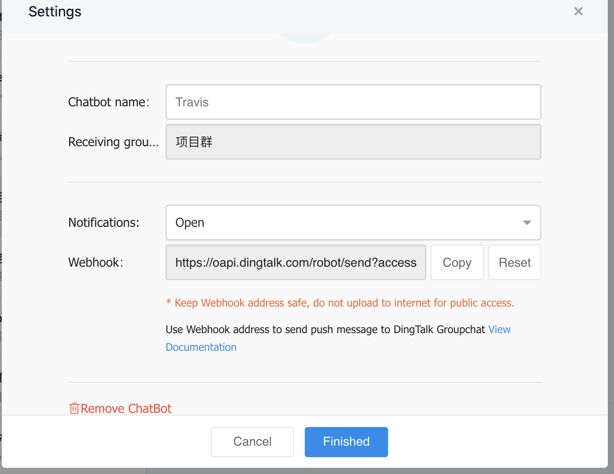

## 概述

   github，一个免费的代码托管平台，非常香。

   travis，一个CI工具，`continue and integration` ，中文意思，持续集成，换句话说，就是帮忙构建代码，测试代码，最后编译成交付的文件。比如Java编译成jar可执行文件，android编译成apk。

 我利用他们，搭建了一个笔记平台，利用travis将md文件转换为html再上传到git仓库，就可以用github page访问生成的页面了。

下面记录下步骤...

## 步骤

### 1、准备
在github创建一个md仓库，仓库名字为mynote
### 2、在github设置traivs CI
setting->Integrations

### 3、导入仓库到traivs
### 4、进入traivs设置仓库

### 5、下载代码，编写.traivs.yml文件
```yaml
language: node_js
node_js: 
  - "10"
before_script:
  - npm i -g github-markdown
script: 
  - rm -rf .git
  - bash ./bootstrap.sh
  - git init
  - git config user.name "newhcw"
  - git config user.email "951123033@qq.com"
  - git add .
  - git commit -m "update note"
  - git push --force --quiet "https://${TOKEN}@${GH_REF}" master:master
 
env:
  global:
     - GH_REF: github.com/newhcw/newhcw.github.io.git
	
notifications:
  webhooks: ${webhooks}

```

我们可以把隐私的信息，配置在traivs的全局变量里面，如下：


其中${TOKEN}是从github获取用来git push代码用的



${webhooks}设置的是钉钉集成travis的机器人的callbackurl，从钉钉群设置获取。


其他部分，是一些脚本的编写，直接看源码了，
这样就CI集成好了。
